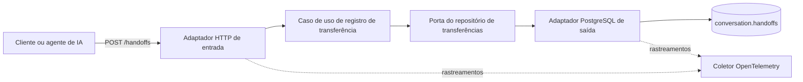
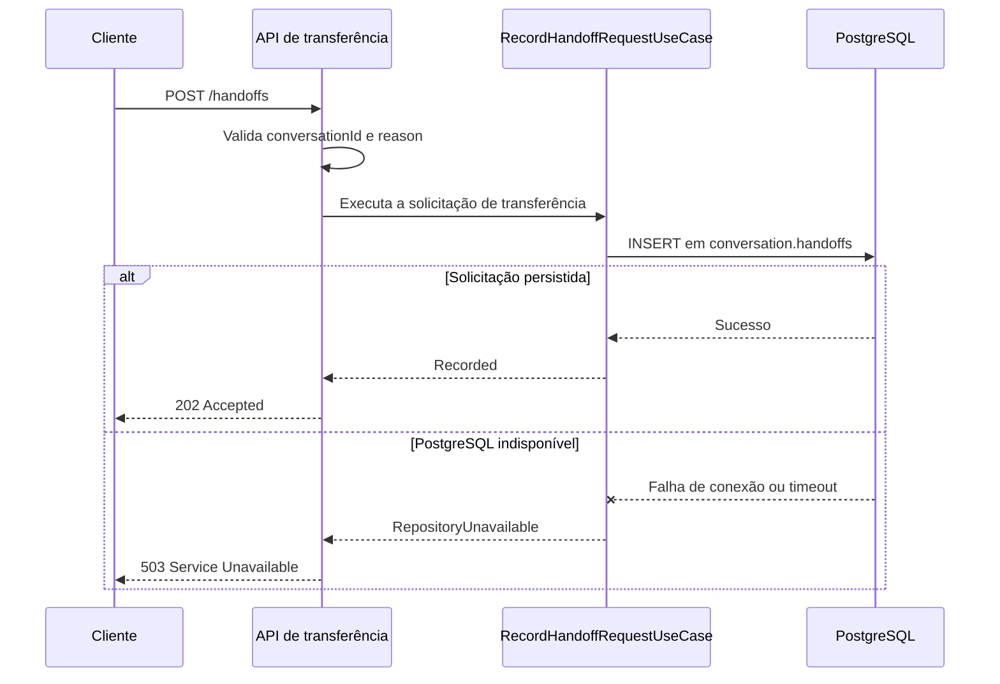

# Serviço de Transferência de Conversas

Serviço leve em ASP.NET Core responsável por registrar solicitações de transferência de uma conversa automatizada para uma fila de atendimento humano.

O serviço expõe um único endpoint HTTP, valida a solicitação de transferência, persiste os dados no PostgreSQL e exporta rastreamentos distribuídos por meio do OpenTelemetry.

## O que este serviço faz

- Recebe solicitações de transferência por meio do endpoint `POST /handoffs`, autenticado com JWT interno.
- Resolve o tenant a partir da claim assinada `tenant_id` (validada contra o header `X-Tenant-Id`), não mais de um valor fixo.
- Exige um header `Idempotency-Key`, persistido com constraint única por `(tenant_id, idempotency_key)` — reenvio da mesma chave não duplica o registro.
- Valida o identificador da conversa e o motivo da transferência.
- Persiste a solicitação na tabela `conversation.handoffs`.
- Direciona as transferências para a fila fixa `human-support`.
- Retorna `503 Service Unavailable` quando o PostgreSQL não está acessível.
- Expõe `GET /health/ready`.
- Exporta rastreamentos do ASP.NET Core e do Npgsql por OTLP.
- Adiciona identificadores de trace, span e parent aos logs da aplicação.

## Arquitetura

O código está organizado utilizando portas e adaptadores, seguindo os princípios da arquitetura hexagonal:



### Fluxo da solicitação



## Stack tecnológica

| Área | Tecnologia |
|---|---|
| Runtime | .NET 8 |
| API | ASP.NET Core Minimal APIs |
| Documentação da API | Swagger / OpenAPI |
| Banco de dados | PostgreSQL |
| Acesso a dados | Npgsql |
| Observabilidade | OpenTelemetry + OTLP |
| Conteinerização | Build Docker em múltiplos estágios |

## Referência da API

### Registrar uma solicitação de transferência

```http
POST /handoffs
Content-Type: application/json
Authorization: Bearer <jwt-interno>
X-Tenant-Id: <tenant>
Idempotency-Key: <chave-estável-por-solicitação>
```

#### Corpo da solicitação

```json
{
  "conversationId": "conversation-12345",
  "reason": "customer_requested_human_agent"
}
```

| Campo | Tipo | Obrigatório | Descrição |
|---|---|---:|---|
| `conversationId` | string | Sim | Identificador da conversa que será transferida. |
| `reason` | string | Sim | Motivo da transferência da conversa para o atendimento humano. |

#### Respostas

| Status | Significado |
|---:|---|
| `202 Accepted` | A solicitação de transferência foi persistida com sucesso (ou já havia sido, para a mesma `Idempotency-Key`). |
| `400 Bad Request` | `conversationId`, `reason` ou `Idempotency-Key` está vazio ou não foi informado. |
| `401 Unauthorized` | JWT ausente, inválido ou expirado. |
| `403 Forbidden` | `X-Tenant-Id` não é UUID ou não bate com a claim `tenant_id` assinada. |
| `503 Service Unavailable` | O PostgreSQL está indisponível ou excedeu o tempo limite. |
| `500 Internal Server Error` | Ocorreu uma falha inesperada na aplicação. |

#### Exemplo

```bash
curl --request POST \
  --url http://localhost:5259/handoffs \
  --header 'Content-Type: application/json' \
  --header 'Authorization: Bearer <jwt-interno>' \
  --header 'X-Tenant-Id: 00000000-0000-0000-0000-000000000001' \
  --header 'Idempotency-Key: conversation-12345:handoff' \
  --data '{
    "conversationId": "conversation-12345",
    "reason": "customer_requested_human_agent"
  }'
```

## Comportamento da persistência

A implementação atual grava os seguintes dados na tabela `conversation.handoffs`:

| Coluna | Valor |
|---|---|
| `tenant_id` | Resolvido da claim `tenant_id` assinada no JWT (validada contra `X-Tenant-Id`) |
| `conversation_id` | `70000000-0000-0000-0000-000000000001` (fixo) |
| `reason` | Valor recebido na solicitação. |
| `target_queue` | `human-support` |
| `metadata` | JSON contendo o identificador original da conversa. |
| `idempotency_key` | Valor recebido no header, com constraint única por `(tenant_id, idempotency_key)` |

Exemplo de `metadata`:

```json
{
  "externalConversationId": "conversation-12345"
}
```

> [!IMPORTANT]
> O identificador real da conversa externa é armazenado atualmente em `metadata`. A chave estrangeira `conversation_id` utiliza um registro seed fixo porque este serviço não cria registros na tabela `conversation.conversations`.

O banco de dados deve conter previamente:

- O schema `conversation`.
- A tabela `conversation.handoffs`.
- Um registro compatível na tabela `conversation.conversations` com o ID `70000000-0000-0000-0000-000000000001`.

As migrations do banco de dados não estão incluídas neste repositório.

## Configuração

As configurações podem ser fornecidas pelo arquivo `appsettings.json`, por arquivos específicos de ambiente ou por variáveis de ambiente.

| Configuração | Variável de ambiente | Valor padrão |
|---|---|---|
| String de conexão do PostgreSQL | `Postgres__ConnectionString` | `Host=localhost;Port=5432;Database=conversational_ai;Username=postgres;Password=postgres` |
| Endpoint OTLP | `Otel__OtlpEndpoint` | `http://localhost:4317` |
| Segredo do chamador `conversation-orchestrator` | `InternalAuth__InboundSecrets__conversation-orchestrator` | (vazio — obrigatório, mínimo 32 bytes) |
| Emissor do JWT | `InternalAuth__Issuer` | `conversational-ai-platform` |
| Audiência esperada | `InternalAuth__ServiceName` | `conversation-handoff-service` |

Este serviço não chama nenhum outro serviço internamente, então `InternalAuth__OutboundSecrets` não precisa de nenhuma entrada. Cada par (emissor, audiência) da plataforma usa um segredo próprio — o valor de `InternalAuth__InboundSecrets__conversation-orchestrator` aqui deve ser idêntico ao configurado como `InternalAuth__OutboundSecrets__conversation-handoff-service` em `conversation-orchestrator`.

Os timeouts de conexão e de comando do PostgreSQL estão limitados a cinco segundos para que falhas no banco sejam retornadas rapidamente como `503 Service Unavailable`.

## Executar localmente

### Pré-requisitos

- .NET 8 SDK.
- PostgreSQL com o schema, as tabelas e o registro seed necessários.
- `InternalAuth__InboundSecrets__conversation-orchestrator` com pelo menos 32 bytes, igual ao `InternalAuth__OutboundSecrets__conversation-handoff-service` configurado em `conversation-orchestrator`.
- Um coletor compatível com OTLP, como Jaeger ou OpenTelemetry Collector, quando a exportação de rastreamentos for necessária.

### Iniciar o serviço

```bash
dotnet restore
dotnet run --launch-profile http
```

O profile HTTP inicia o serviço em:

```text
http://localhost:5259
```

O Swagger fica disponível no ambiente de desenvolvimento em:

```text
http://localhost:5259/swagger
```

### Sobrescrever as configurações

Linux ou macOS:

```bash
export Postgres__ConnectionString='Host=localhost;Port=5432;Database=conversational_ai;Username=postgres;Password=postgres'
export Otel__OtlpEndpoint='http://localhost:4317'
dotnet run --launch-profile http
```

PowerShell:

```powershell
$env:Postgres__ConnectionString = 'Host=localhost;Port=5432;Database=conversational_ai;Username=postgres;Password=postgres'
$env:Otel__OtlpEndpoint = 'http://localhost:4317'
dotnet run --launch-profile http
```

## Executar com Docker

### Criar a imagem

```bash
docker build -t conversation-handoff-service .
```

### Iniciar o container

```bash
docker run --rm \
  --name conversation-handoff-service \
  --publish 8080:8080 \
  --env Postgres__ConnectionString='Host=host.docker.internal;Port=5432;Database=conversational_ai;Username=postgres;Password=postgres' \
  --env Otel__OtlpEndpoint='http://host.docker.internal:4317' \
  conversation-handoff-service
```

O endpoint ficará disponível em:

```text
http://localhost:8080/handoffs
```

No Linux, o acesso a serviços executados no host pode exigir o seguinte parâmetro:

```bash
--add-host=host.docker.internal:host-gateway
```

## Observabilidade

O serviço configura o OpenTelemetry com:

- Instrumentação das solicitações do ASP.NET Core.
- Instrumentação das operações de banco de dados do Npgsql.
- Exportação de rastreamentos por OTLP.
- Nome do serviço definido como `conversation-handoff-service`.
- Correlação de `TraceId`, `SpanId` e `ParentId` nos logs do console.

O span de banco de dados é especialmente relevante porque a latência e a disponibilidade da persistência determinam se o endpoint retorna `202` ou `503`.

## Estrutura do projeto

```text
.
├── Adapters
│   ├── Inbound/Http
│   │   └── HandoffRequestEndpoints.cs
│   └── Outbound/Persistence
│       └── PostgresHandoffRequestRepository.cs
├── Application
│   ├── Ports
│   │   ├── Inbound
│   │   └── Outbound
│   └── UseCases
│       └── RecordHandoffRequestUseCase.cs
├── Configuration
│   ├── OtelOptions.cs
│   └── PostgresOptions.cs
├── Domain
│   └── HandoffRequestRecord.cs
├── Platform
│   └── PlatformServices.cs
├── Program.cs
├── appsettings.json
├── Dockerfile
├── conversation-handoff-service.csproj
└── conversation-handoff-service.Tests/
```

## Testes

```bash
dotnet test
```

`conversation-handoff-service.Tests` inclui testes de integração contra um PostgreSQL real via Testcontainers, montando o script de init real de `conversational-ai-demo-arch/database/conversational-ai-postgres-init.sql` (não um schema de teste à parte) — ver a nota de CI abaixo sobre por que isso exige um checkout adicional.

## CI

`.github/workflows/ci.yml` roda `dotnet build`/`dotnet test` a cada push/PR para `master`. Como os testes de repositório usam Testcontainers com o init script real do `conversational-ai-demo-arch`, o workflow faz um segundo `actions/checkout` desse repo (aninhado no workspace) antes de rodar os testes — sem isso, o teste falha com "Could not locate conversational-ai-postgres-init.sql".

## Limitações atuais

- O serviço utiliza um identificador interno fixo de conversa (registro seed) para todas as transferências.
- A fila de destino está fixa como `human-support`.
- As migrations do banco de dados são gerenciadas fora deste repositório (o schema/tabela usados em produção vêm do `conversational-ai-postgres-init.sql` de `conversational-ai-demo-arch`).
- Falhas de persistência não são submetidas a novas tentativas.

## Próximos passos recomendados

1. Substituir o uso do registro seed por uma estratégia real de propriedade ou integração de conversas.
2. Tornar a fila de destino configurável ou resolvê-la por regras de roteamento.
3. Adicionar rate limiting.
4. Adicionar migrations de banco de dados versionadas neste repositório.
5. Adicionar políticas de resiliência e métricas operacionais.
