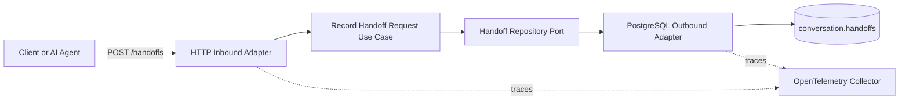
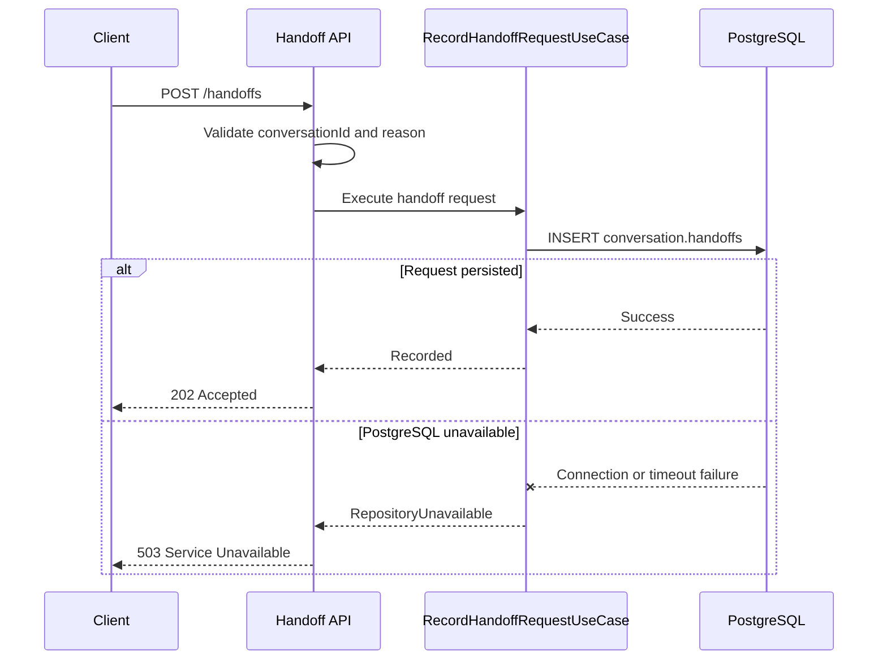

# Conversation Handoff Service

A lightweight ASP.NET Core service responsible for recording requests to transfer an automated conversation to a human-support queue.

The service exposes a single HTTP endpoint, validates the handoff request, persists it in PostgreSQL, and exports distributed traces through OpenTelemetry.

## What this service does

- Receives handoff requests through `POST /handoffs`.
- Validates the conversation identifier and handoff reason.
- Persists the request in `conversation.handoffs`.
- Routes handoffs to the fixed `human-support` target queue.
- Returns `503 Service Unavailable` when PostgreSQL cannot be reached.
- Exports ASP.NET Core and Npgsql traces through OTLP.
- Adds trace, span, and parent identifiers to application logs.

## Architecture

The code is organized using ports and adapters (hexagonal architecture):



### Request flow



## Technology stack

| Area | Technology |
|---|---|
| Runtime | .NET 8 |
| API | ASP.NET Core Minimal APIs |
| API documentation | Swagger / OpenAPI |
| Database | PostgreSQL |
| Data access | Npgsql |
| Observability | OpenTelemetry + OTLP |
| Containerization | Docker multi-stage build |

## API reference

### Record a handoff request

```http
POST /handoffs
Content-Type: application/json
```

#### Request body

```json
{
  "conversationId": "conversation-12345",
  "reason": "customer_requested_human_agent"
}
```

| Field | Type | Required | Description |
|---|---|---:|---|
| `conversationId` | string | Yes | Identifier of the conversation being transferred. |
| `reason` | string | Yes | Reason for transferring the conversation to human support. |

#### Responses

| Status | Meaning |
|---:|---|
| `202 Accepted` | The handoff request was persisted successfully. |
| `400 Bad Request` | `conversationId` or `reason` is empty or missing. |
| `503 Service Unavailable` | PostgreSQL is unavailable or timed out. |
| `500 Internal Server Error` | An unexpected application failure occurred. |

#### Example

```bash
curl --request POST \
  --url http://localhost:5259/handoffs \
  --header 'Content-Type: application/json' \
  --data '{
    "conversationId": "conversation-12345",
    "reason": "customer_requested_human_agent"
  }'
```

## Persistence behavior

The current implementation writes the following data to `conversation.handoffs`:

| Column | Value |
|---|---|
| `conversation_id` | `70000000-0000-0000-0000-000000000001` |
| `reason` | Value received in the request. |
| `target_queue` | `human-support` |
| `metadata` | JSON containing the original conversation identifier. |

Example metadata:

```json
{
  "externalConversationId": "conversation-12345"
}
```

> [!IMPORTANT]
> The real external conversation identifier is currently stored in `metadata`. The `conversation_id` foreign key uses a fixed seed record because this service does not create records in `conversation.conversations`.

The database must already contain:

- The `conversation` schema.
- The `conversation.handoffs` table.
- A compatible row in `conversation.conversations` with ID `70000000-0000-0000-0000-000000000001`.

Database migrations are not included in this repository.

## Configuration

Configuration can be supplied through `appsettings.json`, environment-specific files, or environment variables.

| Setting | Environment variable | Default |
|---|---|---|
| PostgreSQL connection string | `Postgres__ConnectionString` | `Host=localhost;Port=5432;Database=conversational_ai;Username=postgres;Password=postgres` |
| OTLP endpoint | `Otel__OtlpEndpoint` | `http://localhost:4317` |

The PostgreSQL connection and command timeouts are limited to five seconds so database failures are returned quickly as `503 Service Unavailable`.

## Run locally

### Prerequisites

- .NET 8 SDK
- PostgreSQL with the required schema and seed record
- An OTLP-compatible collector, such as Jaeger or the OpenTelemetry Collector, when trace export is required

### Start the service

```bash
dotnet restore
dotnet run --launch-profile http
```

The HTTP profile starts the service at:

```text
http://localhost:5259
```

Swagger is available in the Development environment at:

```text
http://localhost:5259/swagger
```

### Override configuration

Linux or macOS:

```bash
export Postgres__ConnectionString='Host=localhost;Port=5432;Database=conversational_ai;Username=postgres;Password=postgres'
export Otel__OtlpEndpoint='http://localhost:4317'
dotnet run --launch-profile http
```

PowerShell:

```powershell
$env:Postgres__ConnectionString = 'Host=localhost;Port=5432;Database=conversational_ai;Username=postgres;Password=postgres'
$env:Otel__OtlpEndpoint = 'http://localhost:4317'
dotnet run --launch-profile http
```

## Run with Docker

### Build the image

```bash
docker build -t conversation-handoff-service .
```

### Start the container

```bash
docker run --rm \
  --name conversation-handoff-service \
  --publish 8080:8080 \
  --env Postgres__ConnectionString='Host=host.docker.internal;Port=5432;Database=conversational_ai;Username=postgres;Password=postgres' \
  --env Otel__OtlpEndpoint='http://host.docker.internal:4317' \
  conversation-handoff-service
```

The endpoint will be available at:

```text
http://localhost:8080/handoffs
```

On Linux, reaching services running on the host may require:

```bash
--add-host=host.docker.internal:host-gateway
```

## Observability

The service configures OpenTelemetry with:

- ASP.NET Core request instrumentation.
- Npgsql database instrumentation.
- OTLP trace export.
- Service name `conversation-handoff-service`.
- `TraceId`, `SpanId`, and `ParentId` correlation in console logs.

The database span is especially relevant because persistence latency and availability determine whether the endpoint returns `202` or `503`.

## Project structure

```text
.
├── Adapters
│   ├── Inbound/Http
│   │   └── HandoffRequestEndpoints.cs
│   └── Outbound/Persistence
│       └── PostgresHandoffRequestRepository.cs
├── Application
│   ├── Ports
│   │   ├── Inbound
│   │   └── Outbound
│   └── UseCases
│       └── RecordHandoffRequestUseCase.cs
├── Configuration
│   ├── OtelOptions.cs
│   └── PostgresOptions.cs
├── Domain
│   └── HandoffRequestRecord.cs
├── Program.cs
├── appsettings.json
├── Dockerfile
└── conversation-handoff-service.csproj
```

## Current limitations

- The service uses a fixed internal conversation ID for every handoff.
- The target queue is hardcoded as `human-support`.
- There is no authentication or authorization.
- There is no idempotency mechanism.
- Database migrations are managed outside this repository.
- There are no health-check endpoints.
- Persistence failures are not retried.

## Recommended next steps

1. Replace the seed conversation workaround with a real conversation ownership or integration strategy.
2. Make the target queue configurable or resolve it through routing rules.
3. Add authentication, authorization, and rate limiting.
4. Add idempotency to prevent duplicate handoff records.
5. Add database migrations and integration tests.
6. Add readiness and liveness health checks.
7. Add resilience policies and operational metrics.
